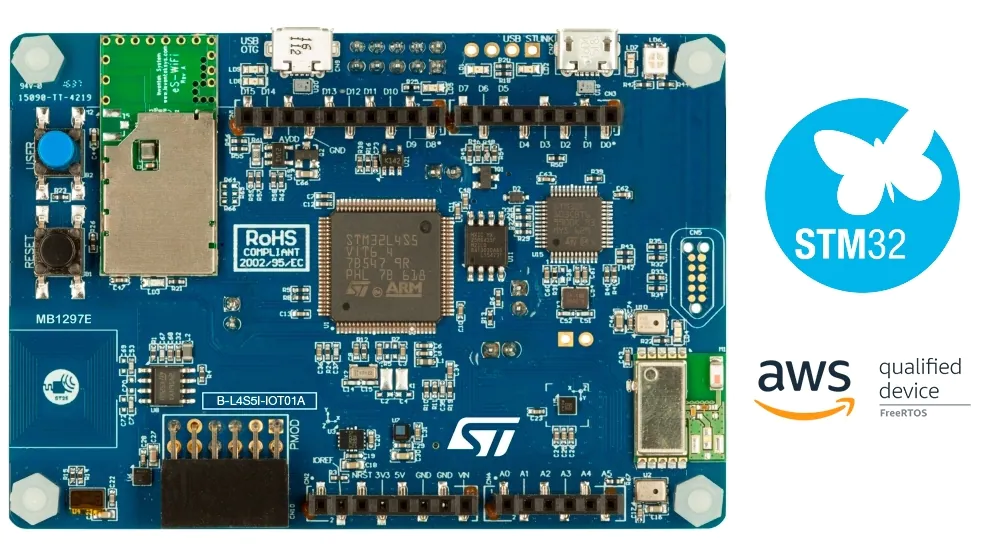

# Microprocessor

  

## LED Blinker:
The STM32Cube Toolchain Lab is a hands-on lab that demonstrates how to configure the B-L475E-IOT01A or B-L4S5I-IOT01A development board and deploy simple software to it. The lab will involve making an LED blink to confirm successful configuration and deployment using the STM32Cube toolchain.

## Math in C, Assembly:
The Matrix Multiplication and Standard Deviation Lab focuses on implementing element-wise matrix multiplication and standard deviation calculations using C, Assembly, and libraries. The lab also includes measuring the execution time for all six combination implementations.

## Speaker tones with GPIO and DAC:
The LED Lighting and Signal Generation lab is about the implementation of LED lighting on button press and generate triangle, saw, and sine signals using C. The implementation signals are confirmed visually and audibly.

## Measuring temperature using ADC:
The Temperature Sensor Lab focuses on implementing C programs to read the internal temperature sensor and reference voltage of a microcontroller. The ADC outputs are scaled to calculate temperature in degrees Celsius using different resolutions (12-bit, 6-bit, 8-bit, or 10-bit).

## Timer, Interrupts, and DMA:
The Interrupts and Digital to Analog Converter (DAC) lab demonstrates how to implement push-buttons and LEDs using interrupts and how to implement DAC using a timer and global interrupt or DMA. Audible confirmation of sine signals at different frequencies, changing on button push are produced.

## Microphone and DFSDM:
The DFSDM Processing and Playback lab demonstrates how to match input and output sampling configuration in MX and implement processing and rescaling of DFSDM output for DAC using C. Additionally, it demonstrates how to implement appropriate interrupts for push-button recording and playback and produce audible confirmation of push-button recording and playback.

## QSPI Flash:
The QSPI and Digital to Analog Converter (DAC) Lab is a programming lab that demonstrates how to implement erasing, writing, and reading using QSPI in C. It also demonstrates how to implement DAC using timer, DMA, and QSPI and produce audible confirmation of sine signals at exactly 5 different frequencies, changing about every three-quarters of a second.

## I2C Peripherals and OS:
The I2C Sensor Reading and Transmission Lab focuses on implementing C programs to initialize and read data from four different I2C sensors. It also demonstrates how to transmit I2C sensor data over UART to a terminal and use a push-button to change what sensor data is transmitted. The lab also includes implementing the above tasks using three different tasks in FreeRTOS.